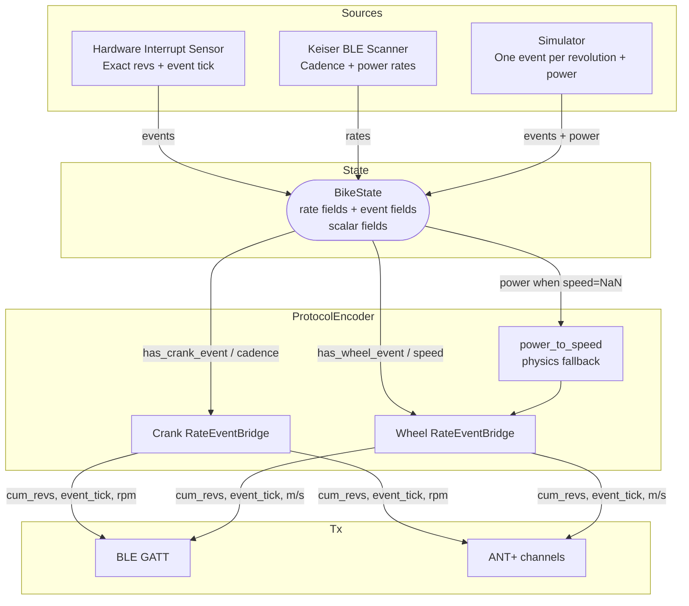

# Development Documentation

This document outlines the data structures and protocol mappings used in the Free Fitness Bridge.

## Key Concepts
- **CP (Cycling Power)**: Standard Bluetooth service for power and cadence. Usually sufficient for most applications.
- **CSC (Cycling Speed and Cadence)**: Dedicated Bluetooth service for speed and cadence.
- **MCU (Microcontroller Unit)**: Small, low-power processors (like ESP32 or nRF52) used for standalone hardware.
- **PWR (Bicycle Power)**: The ANT+ profile for broadcasting power and cadence data.
- **SPD (Bicycle Speed)**: The ANT+ profile for broadcasting speed and distance data. 

## 1. Keiser M3i BLE Advertisement
The Keiser M3i bike broadcasts its data in the **Manufacturer Specific Data (MSD)** field of the BLE advertisement.

| Offset | Size (Bytes) | Field | Description |
| :--- | :--- | :--- | :--- |
| - | 2 | Manuf. ID | `0x0102` (Little Endian: `02 01`) |
| 0 | 1 | Version Major | Major firmware version. |
| 1 | 1 | Version Minor | Minor firmware version. |
| 2 | 1 | Data Type | `0x00` (Real-time data). |
| 3 | 1 | Bike ID | Ordinal ID. |
| 4-5 | 2 | Raw Cadence | Little Endian. RPM = `value / 10`. |
| 6-7 | 2 | Heart Rate | Little Endian. BPM = `value / 10`. |
| 8-9 | 2 | Power | Little Endian. Watts. |
| 14-15| 2 | Distance | Little Endian. Unit 0.1 (Miles or KM). |
| 16 | 1 | Gear | Current gear setting. |

## 2. Data Pipeline Architecture

### 2.1 Why a bridge is needed
BLE (FTMS, CSC, CP) and ANT+ (Power, Speed/Cadence) are modeled around physical hardware sensors. They require **discrete, monotonically increasing integer counts** (cumulative wheel / crank revolutions) paired with **precise event timestamps** at 1/1024-second resolution.

Incoming sources rarely give us those directly:
- `KeiserBike` broadcasts *instantaneous rates* — cadence (RPM) and power (W).
- `SimulatedCrankPowerSource` emulates a hall-effect sensor: one event per revolution + power.
- A real hall sensor on the MCU will one day give us exact `cumulative_revolutions` + `event_tick`.

The pipeline normalizes all three into the same two-view state so protocol encoders can read whichever half they need.

### 2.2 Rate view vs event view
Every rotating channel (crank, wheel) has two equivalent representations:
- **rate view**: revolutions per second — continuous, what humans read.
- **event view**: cumulative revolution count + timestamp of the most recent integer crossing (1/1024 s ticks) — what the wire formats require.

`RateEventBridge` converts between the two in both directions:
- `feed_rate(rate_rps, now_tick)` integrates the rate and back-interpolates an event tick whenever the running count crosses the next integer.
- `feed_event(cum_revs, event_tick, now_tick)` adopts hardware events and derives rate from Δcount / Δtick across consecutive events.

This bidirectional fill is what lets event-driven sources expose cadence and rate-driven sources expose event timing without the source having to know which consumer needs what.

### 2.3 Internal state (`BikeState` / MCU `BikeData`)
A single struct carries the source's natural output. `NaN` marks an unknown scalar; `has_*_event` marks the source as authoritative owner of that channel's event fields. All ticks are 1/1024 s.

| Field | Type | Description |
| :--- | :--- | :--- |
| `power` | float / uint16 | Instantaneous power in Watts (`NaN` = unknown). |
| `cadence` | float / uint8 | Instantaneous cadence in RPM (`NaN` = unknown; encoder bridge can derive). |
| `speed` | float | Instantaneous wheel speed in m/s (`NaN` = unknown). |
| `hr` | float | Heart rate in bpm (`NaN` = unknown). |
| `resistance_pct` | float | Brake / gear resistance 0..100 (`NaN` = unknown). |
| `incline_pct` | float | Simulated grade −100..100 (`NaN` = unknown). |
| `distance_m` | float | Cumulative session distance in meters. |
| `elapsed_s` | float | Session duration in seconds. |
| `has_crank_event` | bool | Source owns `crank_revs` / `crank_event_tick`. |
| `crank_revs` | uint16 | Cumulative crank revolutions. |
| `crank_event_tick` | uint16 | Tick of last crank event. |
| `has_wheel_event` | bool | Source owns `wheel_revs` / `wheel_event_tick`. |
| `wheel_revs` | uint32 | Cumulative wheel revolutions. |
| `wheel_event_tick` | uint16 | Tick of last wheel event. |
| `last_update_tick` | uint32 | Tick at which the source last stamped fresh data. Silence detection compares against `get_tick_now()`. |

ANT+ power-page accumulators (`accPower`, `eventCount`) are not source state — they live in the protocol encoder.

### 2.4 Data flow

### 2.5 Dispatch rules in the encoder
Per rotational channel, the encoder feeds whichever half the source provides:
- Crank: `has_crank_event` → `bridge.feed_event(...)`; else `!isnan(cadence)` → `bridge.feed_rate(cadence / 60, now_tick)`.
- Wheel: `has_wheel_event` → `bridge.feed_event(...)`; else `!isnan(speed)` → `bridge.feed_rate(...)`; else `!isnan(power)` → derive via `power_to_speed(power)` then feed. Power → speed is the only physics hop in the pipeline.

Silence: if `state.last_update_tick` has not advanced within ~2 s of `get_tick_now()`, the encoder flips `no_data = True` and the tx layers skip transmitting. The encoder polls at 20 Hz so it can observe silence — an event-blocked encoder never would.

## 3. Bluetooth GATT Transmission
The bridge uses a dynamic Device Name in the format `FreeFitness-XXXX`, where `XXXX` is the last 4 hex digits of the Flash Unique ID.

> [!TIP]
> Some BLE central devices (like nRF Toolbox or certain head units) require the presence of a **Battery Service (0x180F)** and **Control Point characteristics** (SC/CP Control Point) to correctly discover and maintain a connection to the sensor.

### Cycling Power (CP) - Service `0x1818`
> [!NOTE]
> CP provides **both power and cadence data**. In most cases, this service is sufficient for all target applications.
- **Measurement Characteristic (`2A63`)**:
  - Flags: `0x0000` (Instantaneous Power only).
  - Power: `uint16` (Little Endian, Watts).

### Cycling Speed and Cadence (CSC) - Service `0x1816`
> [!NOTE]
> CSC is primarily used for speed and cadence data. It is often redundant when CP is active.
- **Measurement Characteristic (`2A5B`)**:
  - Flags: `0x03` (Wheel + Crank Data Present).
  - Wheel Data: `uint32` (Cumulative Revs) + `uint16` (Last Event Time).
  - Crank Data: `uint16` (Cumulative Revs) + `uint16` (Last Event Time).

## 4. ANT+ Transmission
The bridge operates as a multi-sensor node using two independent ANT+ channels. The **Device Number** is dynamically derived from the Flash Unique ID.

### Channel 0: Bicycle Power
- **Device Type**: `0x0B` (11)
- **Transmission Type**: `5` (ANT+)
- **Period**: `8182` (4.00 Hz)

| Page | Name | Description |
| :--- | :--- | :--- |
| `0x10` | Power Only | Instantaneous and accumulated power + cadence. |
| `0x50` | Manufacturer Info | HW Revision, Manufacturer ID (`0x3862`), Model Number. |
| `0x51` | Product Info | SW Revision, 32-bit Serial Number (from Flash ID). |
| `0x52` | Battery Status | Coarse voltage and status (Good/Low). |

### Channel 1: Bicycle Speed
- **Device Type**: `0x7B` (123)
- **Transmission Type**: `5` (ANT+)
- **Period**: `8118` (4.03 Hz)

| Page | Name | Description |
| :--- | :--- | :--- |
| `0x00` | Speed Data | Cumulative revolutions and last event time. |
| `0x50` | Manufacturer Info | Synchronized with Channel 0. |
| `0x51` | Product Info | Synchronized with Channel 0. |
| `0x52` | Battery Status | Synchronized with Channel 0. |

## 5. Device Identification & Versioning
Configuration is managed centrally in `mcu/config.h`.

| Attribute | Source | Value |
| :--- | :--- | :--- |
| Device Serial | Flash Unique ID | 64-bit Hex String |
| ANT Device # | Flash Unique ID | 16-bit Truncated ID |
| BLE Name | `config.h` + ID | `-XXXX` |
